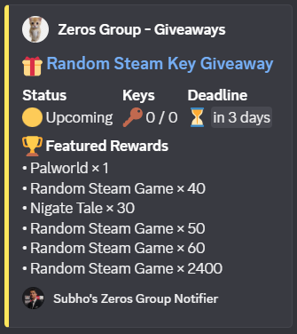

# 🎁 Zeros WS Notifier

A lightweight Discord notifier for **Zeros Group** Steam key giveaways.

Unlike browser automation, this project connects directly to the site's WebSocket endpoint, making it extremely fast and lightweight.

---

## ✨ Features

- ⚡ Direct WebSocket connection
- 🎮 Automatic Steam game name lookup via IGDB
- 🔔 Discord webhook notifications
- 🟡 Upcoming / 🟢 Live / 🔴 Expired detection
- 🏆 Featured rewards list
- 💾 Persistent state (no duplicate notifications)
- 🤖 Runs automatically with GitHub Actions every 5 minutes

---

## Preview

*(Discord embed screenshot here)*

---

## Example Notification



---

## Installation

```bash
git clone https://github.com/Subho801/zeros-ws-notifier.git

cd zeros-ws-notifier

pip install -r requirements.txt
```

---

## Configuration

Create GitHub Secrets or environment variables.

```
DISCORD_WEBHOOK_URL=
TWITCH_CLIENT_ID=
TWITCH_CLIENT_SECRET=
```

---

## Run

```bash
python main.py
```

---

## How it works

```
Zeros WebSocket
        │
        ▼
WebSocket Client
        │
        ▼
IGDB Lookup
        │
        ▼
Discord Embed
```

---

## Tech Stack

- Python
- websocket-client
- Requests
- GitHub Actions
- IGDB API

---

## Project Structure

```
.
├── discord.py
├── game_lookup.py
├── igdb.py
├── websocket_client.py
├── main.py
├── posted.json
├── game_cache.json
└── requirements.txt
```

---

## License

MIT
